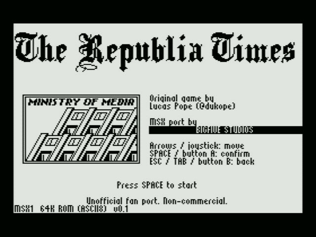
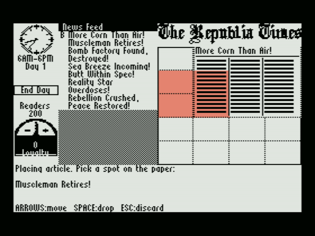

# The Republia Times — MSX port

**MSX port by BigFive Studios** · Original game by **Lucas Pope** (@dukope)

A faithful MSX1 port of *The Republia Times*: you are the new editor-in-chief of a state
newspaper. Pick news from the feed, choose how big each article is, lay out the paper, and keep
the public — and your family — safe. Rules, news items, goals, texts and endings come straight from
the original source; graphics were converted/adapted to print on a 256×192 screen.

| | |
|---|---|
| Target | MSX1 or better (tested: openMSX 19.1 + C-BIOS MSX1/MSX2, 50 and 60 Hz) |
| Format | 64 KB ROM, ASCII8 mapper (`dist/republia-msx-0.1.rom`) |
| Video | Screen 2 (256×192), black ink on white paper |
| Audio | PSG (music A+B, SFX C) — no expansion needed |
| RAM | 16 KB is enough (uses 6.4 KB + stack) |
| Status | playable end-to-end; emulator-tested only (see `docs/PORTING.md`) |

 

## Controls
| action | keyboard | joystick |
|---|---|---|
| move / select | cursor keys or **MSX mouse** | stick (port 1 or 2) |
| confirm, pick up, drop | SPACE or RETURN, mouse left button | button A |
| cancel / discard / switch feed↔paper | ESC or TAB, mouse right button | button B |
| sound on/off | M | – |

In the **feed**: ↑/↓ choose a news item (the bottom panel shows the whole text), ←/→ choose the
article size (BIG 3×3, MED 2×2, SMALL 1×2 cells), `A` picks it up. In **placement**: arrows move the
footprint over the 4×5 grid (green = free, red = overlapping), `A` drops, `B` discards. `B` in the
feed switches to **paper mode** to pick placed articles up again. Select **End Day** (below the last
feed item) to speed time up ×10. Longer briefings are paged with `A`.

**Mouse** (MSX mouse in joystick port 1 or 2; plug it in *before* powering on / resetting and leave it still on the title screen so it is detected): a hand pointer appears as soon as the mouse moves. Hover a feed item to select it, click the BIG/MED/SMALL block at the bottom to choose the size, click the item to pick it up, move over the paper (the green/red footprint follows the pointer), left-click to drop, right-click or click outside the paper to discard. Click a placed article to pick it up again; click **End Day** to speed the day up. Pressing any keyboard key or joystick button hides the pointer and returns to the pad model.

Loyalty goals, article size multipliers (×1 / ×3 / ×6), "interesting" topics (war, sports,
entertainment, weather) and the rebel path work exactly as in the original; the in-game briefings
explain them day by day.

## Build / run
```bash
./scripts/setup.sh      # clones MSXgl v1.5.0 (pinned commit, bundles SDCC 4.6.0), installs openMSX/pillow
./scripts/build.sh      # assets -> compile -> link -> ROM in dist/ (+ .map, SHA-256)
./scripts/run.sh        # interactive openMSX (C-BIOS MSX1 50 Hz)
./scripts/test.sh       # headless smoke + gameplay tests, screenshots in screenshots/
```
Requirements: Linux/macOS, Node.js (MSXgl build scripts), Python 3 + Pillow + NumPy, ffmpeg
(music transcription), openMSX. Details/versions: `docs/TOOLCHAIN.md`.
Debug ROMs (jump to a day / set loyalty): `RT_TAG=x RT_DEFINES="-DDBG_START_DAY=8 -DDBG_LOYALTY=-12" ./scripts/build.sh`.

Run on hardware: copy `dist/republia-msx-0.1.rom` to a cartridge/flash cart configured as
**ASCII8**. (*Not tested on real hardware yet.*)

## Repository layout
```
original/   untouched Flash/Flixel sources and assets (source of truth)
src/        main.c, platform/ (gfx, input, audio, ISR, seg), game/ (rules, screens), data/ (generated)
tools/      gen_assets.py (news, fonts, bitmaps), gen_music.py (MP3 -> PSG)
scripts/    setup, build, run, shot, test
tests/      openMSX Tcl tests      screenshots/  captured frames       docs/  porting + toolchain notes
dist/       built ROMs, maps, hashes
```

## Credits
* **Original game, design, art, text, music:** Lucas Pope — @dukope
* **MSX port (conversion, engine, tooling):** **BigFive Studios**
* Engine: MSXgl by Aoineko (CC BY-SA 4.0) · Compiler: SDCC · Emulator: openMSX · BIOS for tests: C-BIOS
See `LICENSES.md` — the original ships without a license file; ask the author before redistributing.
