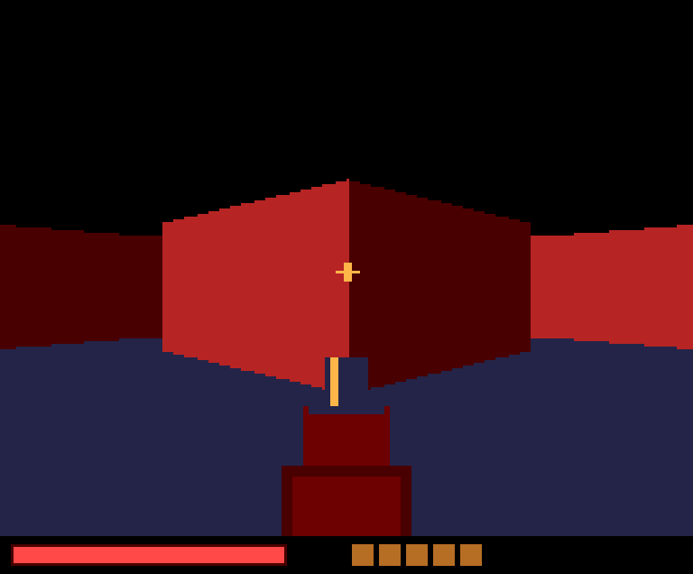
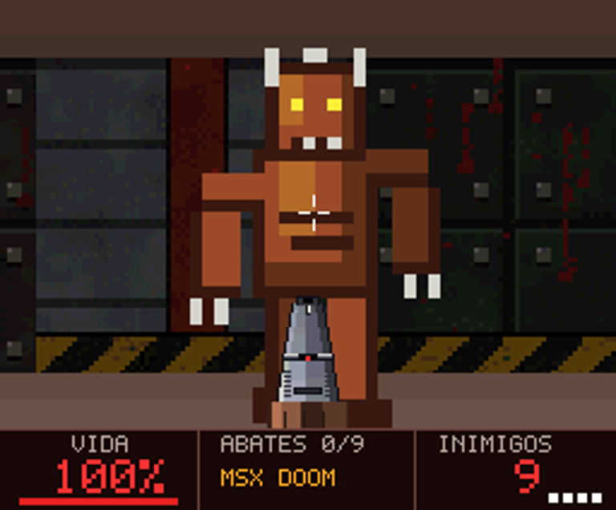

# MSX DOOM — ROM texturizada (turbo R + V9968 + Geo3D)

ROM **ASCII16** de 1 MiB em C/SDCC: SCREEN 8 com paleta **EPAL de 256 cores**, paredes **texturizadas pelo Geo3D**
(LRMM por linha), inimigos como billboards texturizados com transparência, arma/mira/HUD por blits de fonte.
O protótipo web com a mesma arte está em [`../msxdoom`](../msxdoom).

 

```sh
./build.sh                         # SDCC >= 4.2, Python 3, numpy, pillow  ->  out/msxdoom.rom
python3 tools/test_boot.py         # boot no Z80 emulado: VRAM, paleta, quadro e aviso de Geo3D ausente
# o simulador usa o modelo do desenvolvedor: git clone https://github.com/alexmoncks/V9968_Cartridge e
#   export GEO3D_SIM=<clone>/geo3d/sim   (padrão: /home/user/alexmoncks/v9968_cartridge/geo3d/sim)
python3 tools/test_game.py         # 7 testes de lógica (andar, girar, colisão, tiro, fim de jogo, reinício)
python3 tools/z80_harness.py 4     # renderiza quadros em out/harness_N.png
node tools/export_art.js           # (opcional) reexporta a arte de ../msxdoom/sprites.js para assets/*.png
```
Rodar (**o tipo de ROM precisa ser ASCII16 explicitamente**):

```text
# turbo R / R800 (BIOS própria):
openmsx -machine Panasonic_FS-A1ST_V9968 -ext geo3d -cart out/msxdoom.rom -romtype ASCII16
# MSX2+ / Z80, sem turbo R e sem BIOS dumpada (C-BIOS):
openmsx -machine C-BIOS_V9968_JP -ext geo3d -cart out/msxdoom.rom -romtype ASCII16
```
`machines/C-BIOS_Z80_V9968_Geo3D.xml` (neste repositório) é a mesma máquina com o Geo3D já embutido: copie para `share/machines/` e rode `openmsx -machine C-BIOS_Z80_V9968_Geo3D -cart out/msxdoom.rom -romtype ASCII16` **sem** `-ext geo3d`. **UNTESTED** (montei o XML a partir dos dois arquivos de origem, validei só que é XML bem formado).

`C-BIOS_V9968_JP` não vem no openMSX oficial: é o `config/machines/C-BIOS_V9968_JP.xml` do repositório
[renatus-xxxx/openmsx-v9968-windows-setup](https://github.com/renatus-xxxx/openmsx-v9968-windows-setup) (o `setup-cbios-v9968.bat` monta o ambiente),
usado com o openMSX com Geo3D de [alexmoncks/openMSX](https://github.com/alexmoncks/openMSX) (ramo `geo3d`), conforme o `README.geo3d.md` dele.
Nesse perfil `MSXVER=2`, então a ROM **não** chama `CHGCPU` e roda em Z80. **Z80 não é mais rápido que o R800**: use-o só se o turbo R der problema. Controles: cursor ←/→ giram, ↑/↓ andam, ESPAÇO atira/reinicia.

## Status de validação

| Nível | Resultado |
|---|---|
| BUILD OK | Sim. SDCC 4.2.0. Código: 10 KB do banco 1; 36 bancos de dados (texturas + conjuntos visíveis de 154 células); ROM 1 MiB. |
| BOOT OK | **UNTESTED** (openMSX, blueMSX+, FPGA, hardware) |
| SIMULATED | Sim: a ROM roda num Z80 emulado (pip `z80`) com modelo próprio e simplificado de ASCII16 e do V9968 (SCREEN 8, EPAL, HMMV, LMMM/TIMP). O **Geo3D é simulado pelo modelo de referência bit-exato do desenvolvedor** (`geo3d/sim/gen_scenes.py::render_faces`, em `alexmoncks/V9968_Cartridge`) com um executor de LRMM conforme `vdp_command.v`. `test_boot.py`, `test_game.py` e `test_mulq14.py` passam. **Não é um emulador de MSX.** |
| EMULATOR TESTED | **Relatado pelo usuário, não verificado por mim:** v5 no openMSX (fork Geo3D) com a máquina `C-BIOS_R800_V9968_Geo3D` (definição própria do usuário; não tenho o XML), com `-ext geo3d` e `-romtype ASCII16`: "melhorou muito" em velocidade. Sem medição de fps, sem vídeo e sem confirmação dos marcadores do HUD. |
| FPGA TESTED / HARDWARE TESTED | **UNTESTED** |

```text
MSXgl: não usado                    SDCC: 4.2.0 #13081
V9968 spec/revision: hra1129/V9968_Cartridge 55966fb (RTL: vdp_cpu_interface.v, vdp_command.v)
Geo3D reference model / demos: alexmoncks/V9968_Cartridge eeb13f4 (geo3d/sim, geo3d/z80/geo3d_tex_demo.asm, geo3d/game)
Geo3D spec/revision: geo3d_engine.v (alexmoncks, v1.0.0)  | referências: kanon-ai/V9968_Geo3D_SampleDemo 3fe8a01, NEON_REVENANT 030555e
openMSX build / commit / Machine XML: não testado
V9968 configuration: I/O base 0x98 (Geo3D em 0x9D/0x9F)    Mapper: ASCII16   ROM size: 262144
Target machine: MSX turbo R + V9968 + Geo3D    CPU mode: R800 ROM (CHGCPU 0x81) se MSXVER>=3
Test status: BUILD OK + SIMULATED; EMULATOR: relato do usuario (v5, C-BIOS_R800_V9968_Geo3D); FPGA/HARDWARE UNTESTED
```

## Como funciona
- **Mapper:** banco 0 = cabeçalho `AB` + boot; o boot seleciona o banco 1 na janela 0x8000 (`0x7000`) e faz `ENASLT` da página 2 para o slot do cartucho; o **código roda do banco 1**. Os dados ficam nos bancos 2+, lidos pela janela 0x4000 (registrador em `0x6000`).
- **Vídeo:** `R#0=14` (SCREEN 8), `R#20=0x11` (EPAL + HS) após `OUT (0x9C),0`, `R#21=0`, `R#16`+porta `0x9A` com 256×(R,G,B de 5 bits) (RTL: `vdp_cpu_interface.v`). `R#51..58 = 0,0,0,0,255,0,255,3` (janela de origem do LRMM), como o NEON_REVENANT.
- **VRAM (256 KiB = 1024 linhas de 256 B):** páginas de desenho em 0..511 (`YPAGE = página<<8`); texturas em 512..1023 (carregadas no boot a partir dos bancos 2..9):

| Linhas | Conteúdo |
|---|---|
| 512–575 | atlas de paredes 256×64 (4 tiles 64×64), cópia escura (nível 0) |
| 576–639 | sprites 256×64 (2 tipos × 6 poses, 24×32), sem sombra |
| 640–703 | atlas de paredes, cópia média (nível 2) |
| 768–831 | atlas de paredes, cópia clara (nível 4) |
| 832–895 | pistola (parada e disparando) e clarão |
| 896–934 | fontes 5×7 (cinza, laranja, vermelho) e dígitos grandes |

- **Por que só 3 cópias de sombra:** o Geo3D escolhe a linha-fonte por `TEXY + nível*TSTRIDE`. A luz é **fixa no mundo** (recalculada por quadro no espaço da câmera), então paredes alinhadas aos eixos só recebem os níveis 0, 2 e 4; os intervalos entre as cópias guardam sprites. Com `TSTRIDE=0` os sprites usam uma cópia só.
- **Paleta (256):** 63 cores-base escolhidas por median-cut sobre as texturas, em 3 brilhos (índices 1–63 claro, 65–127 médio, 129–191 escuro; 0 = preto/transparente) + 14 rampas de teto/chão + cores do HUD.
- **Geometria (PVS por célula):** `tools/pvs.py` calcula, para cada célula aberta do mapa, quais paredes podem ser vistas dali (visibilidade 2D com 9 pontos de vista × 3 amostras por parede). Cada parede vira 8/4/2/1 tiras conforme a distância (limita a distorção afim e o buraco do plano próximo): 66–106 faces e ≤218 vértices por célula (limite do Geo3D: 255; reservei 246/219 para os inimigos). **Ao entrar numa célula** a ROM envia esse conjunto ao Geo3D uma única vez (~2,5 KB); por quadro vão só a matriz, a luz, as faces dos inimigos e o RUN. Jogador com raio de colisão 14 e `ZNEAR=2`.
- **Inimigos:** cada inimigo visível vira um quad (billboard) em coordenadas de mundo, anexado às faces da célula **no mesmo RUN**; o Geo3D ordena (painter) paredes e sprites juntos. A normal do quad gera o nível de sombra 1, cuja cópia de textura (linhas 576–639) é o atlas de sprites; `LOP=8` (TIMP) dá a transparência. Só são enviados se estiverem no campo de visão e com linha de visão livre (recalculada a cada 4 quadros).
- **Arma e HUD:** LMMM com TIMP a partir da VRAM; o painel (y ≥ 178) é desenhado nas duas páginas, e os valores só são redesenhados quando mudam.

## Conferido contra o código do desenvolvedor do Geo3D
Li o `geo3d_tex_demo.asm`, o jogo `geo3d/game/*.asm`, `geo3d_rom.asm` e o modelo de referência. Bate: sequência de registradores (config em `0x18`, bloco `0x40`, streams `0x50/0x52/0x53`, `0x58` e `0x60`), RUN por `0x48`, espera por `bit0` do status, detecção de Geo3D ausente (`IN A,(0x9D)` = `0xFF`), tempo-limite nas esperas, desbloqueio `Port#4`, `R#21=0`, `R#20` com HS, janela de origem `R#51–58`, `ROM_AS16` em `0x4010`. O TIMP no LRMM está no RTL (`func_lop`). As faces/skip/níveis de sombra foram conferidos com o `render_faces` dele. Diferenças conscientes: eu uso SCREEN 8/EPAL (ele, nas demos, SCREEN 5), `F=170`, `ZNEAR=2`.

## Suposições NÃO verificadas em emulador/hardware (revisar primeiro se algo falhar)
1. **TIMP no LRMM:** `LOP=8` nos sprites faz o texel 0 ser transparente. Está no RTL (`func_lop`), mas não vi o comportamento num emulador. Se estiver errado, os inimigos aparecem com fundo preto. As paredes usam `LOP=0`, como a demo do desenvolvedor.
2. Matriz enviada linha a linha e `p' = M·v + T`; câmera +Z frente/+X direita/+Y cima; `F=170, CX=128, CY=89, ZNEAR=2, W=256, H=178`.
3. Coordenadas U/V são relativas a `TEXX/TEXY` (e o nível soma `nível*TSTRIDE` às linhas), como descreve o cabeçalho de `geo3d_engine.v`.
4. `IN A,(0xFF)` / `XOR 1` / `OUT (0xFE),A` no boot foi **copiado de todas as demos kanon-ai**; a finalidade não está documentada (provavelmente configuração do cartucho/máquina V9968).
5. Teclado: linha 8 da matriz (setas e espaço), como no NEON_REVENANT; PSG: `R7=0xB7`. `R#2 = 0x1F | página<<5` para trocar de página; polling de VBLANK em S#0 bit 7.
6. A rampa de brilho e o atlas foram validados só pelo meu simulador (rasterização afim por linha, como descrito no RTL).

## Achados e limitações
- **Bug do SDCC 4.2.0:** `(s32)a*b` com multiplicador negativo deu resultado errado; o jogo usa `mulq14()` (soma e deslocamento), validado contra Python em 600 pares.
- **Desempenho (medido só em simulação; UNTESTED no openMSX):** `tools/profile.py` conta T-states de CPU por quadro. v1: ~1,21 M; v4: ~0,56 M; **atual: ~0,16 M (~22 fps de teto de CPU em Z80 de 3,58 MHz)**. O envio ao Geo3D caiu de ~11 KB para ~1,3 KB por quadro e de 16 RUNs para 1 por quadro. Ganhos desde a v1: `mulq14` em assembly (`src/math.s`), conjuntos visíveis por célula enviados só ao mudar de célula, `los()` sem divisão e em cache, HMMV nos preenchimentos, inimigos fora de vista filtrados e inimigos distantes parados. **Não medi** o tempo de VDP/Geo3D (LRMM, HMMV) no emulador, que pode dominar. Para referência, as demos de Geo3D texturizado do desenvolvedor rodam a 5–13 fps no openMSX dele. Ao mudar de célula há um pico (~2,5 KB a mais num quadro).
- Sem Z-buffer por pixel: o Geo3D ordena por face (soma dos Z dos 4 vértices), então um sprite muito perto de uma parede oblíqua pode ordenar errado em casos extremos. Sem sombreado por distância. A ROM cresceu para 1 MiB porque guarda um conjunto visível por célula (~614 KB); cabe em ASCII16.
- Sem mouse, sem portas que abrem, sem tela de título, sem texto de vitória/derrota (só uma faixa colorida).
- **Diagnóstico na tela:** se o Geo3D não responder (porta `0x9D` lê `0xFF`), a ROM mostra "GEO3D NAO ENCONTRADO" em vez de travar; esperas pelo Geo3D têm limite de tempo. Quatro quadradinhos brancos no canto inferior direito do HUD marcam o progresso (1 boot/VRAM/paleta, 2 Geo3D detectado, 3 primeiro quadro desenhado, 4 primeiro quadro exibido); do 3º em diante ficam avermelhados se um RUN do Geo3D estourou o tempo. HUD aparecendo com a área 3D preta = o jogo parou esperando o Geo3D (use `-ext geo3d`).
- **Se a imagem sair preta ou sem texturas**, verifique nesta ordem: ROM tipo ASCII16; extensão `geo3d` no openMSX; EPAL/`R#20`; janela do LRMM (`R#51–58`).
